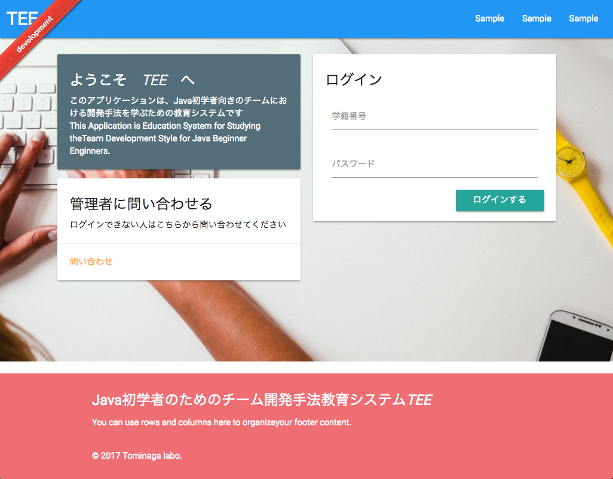

# TEE (WIP)



Status
---

| type | badge |
|---|---|
| circle-ci | [](https://circleci.com/gh/SLP-KBIT/TEE) |
| codeclimate | [](https://codeclimate.com/github/SLP-KBIT/TEE) |
| hakiri | [](https://hakiri.io/github/SLP-KBIT/TEE/master) |

About
---

**T**eam **E**ducation **E**xrc for Software enginnering.

Environment
---

- dependency libraries
  - `redis-server` >= 3.0.6
  - `rails` == 5.0
  - `ruby` >= 2.3.0
  - `bundler` >= 1.12.3
  - `node` >= 6.8
  - `yarn` >= 0.17.10
  - `react` >= 15.0

- dot-env
  - `INQUIRY_SLACK_URL` : 問い合わせ時に利用するslackのincoming-apiのURL
  - `INQUIRY_SLACK_CHANNEL` : 問い合わせを連絡する先のチャンネル

Start Deveopment
---

```bash
$ bundle install && yarn
$ cd client && yarn && cd ..
$ postgres -D /usr/local/var/postgres
$ redis-server
$ bundle exec sidekiq
$ bundle exec rails server
$ cd client && npm run build:development
```

LICENSE
---

- TODO
