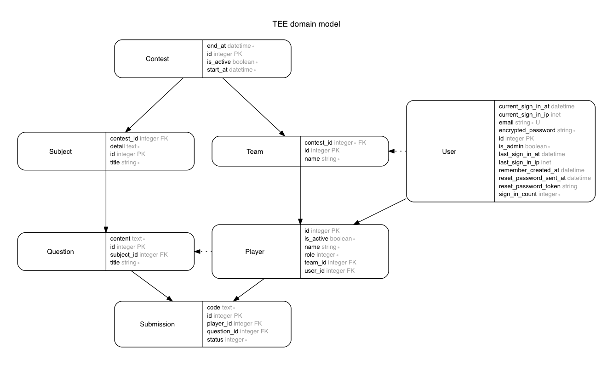

# TEE (WIP)


About
---

TEE is a Exercise System of Team Development and OOP for Beginner Java Engineer.


Status
---

| type | badge |
|:---:|:---:|
| codacy | [](https://www.codacy.com/app/MaxMEllon/TEE?utm_source=github.com&utm_medium=referral&utm_content=MaxMEllon/TEE&utm_campaign=badger) |
| circle-ci | [](https://circleci.com/gh/MaxMEllon/TEE) |
| codeclimate | [](https://codeclimate.com/github/MaxMEllon/TEE) |
| hakiri | [](https://hakiri.io/github/MaxMEllon/TEE/master) |

Throughput
---

[](https://waffle.io/MaxMEllon/TEE)


Environment
---

- dependency libraries
  - `redis-server` >= 3.0.6
  - `rails` == 5.0
  - `ruby` >= 2.4.0
  - `bundler` >= 1.12.3
  - `node` >= 6.9
  - `yarn` >= 0.17.10 || `npm` >= 4.1.1
  - `react` >= 15.0

- dot-env
  - `INQUIRY_SLACK_URL` : 問い合わせ時に利用するslackのincoming-apiのURL
  - `INQUIRY_SLACK_CHANNEL` : 問い合わせを連絡する先のチャンネル

Domain Model
---



Start Deveopment
---

```bash
$ bundle install && yarn
$ cd client && yarn && cd ..
$ postgres -D /usr/local/var/postgres
$ redis-server
$ bundle exec sidekiq
$ bundle exec rails server
$ cd client && npm run build:development
```

- with docker

```bash
$ docker-compose build
$ docker-compose up
$ docker-compose run app bundle exec rails db:create
$ docker-compose run app bundle exec rails db:migrate
$ docker-compose run app bundle exec rails db:seed
```

LICENSE
---

- TODO
